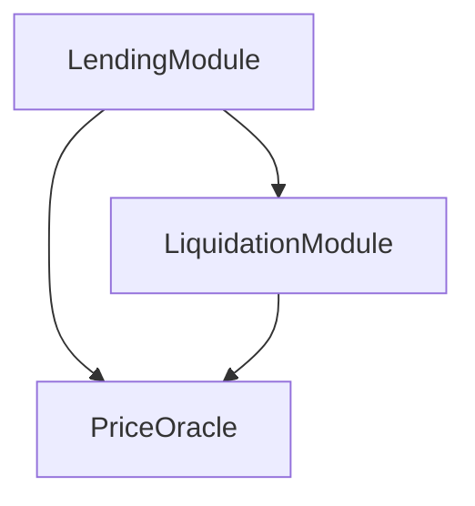

# FSCA CLI 完整使用指南

> Financial Smart Contract Architecture - 链上智能合约集群开发工具

---

## 目录

1. [快速开始](#快速开始)
2. [核心概念](#核心概念)
3. [安装与配置](#安装与配置)
4. [命令参考](#命令参考)
5. [完整工作流](#完整工作流)
6. [高级用法](#高级用法)
7. [最佳实践](#最佳实践)
8. [故障排查](#故障排查)

---

## 快速开始

### 5 分钟快速体验

```bash
# 1. 安装
npm install -g fsca-cli

# 2. 创建项目
mkdir my-defi-project && cd my-defi-project

# 3. 初始化
fsca init

# 4. 部署集群管理器
fsca cluster init

# 5. 部署第一个合约
fsca deploy "MyFirstPod"

# 6. 挂载到集群
fsca cluster mount 1 "MyFirstPod"

# 7. 查看集群状态
fsca cluster list mounted
```

---

## 核心概念

### 什么是 FSCA?

FSCA 将**微服务架构**引入智能合约开发,解决传统合约的不可变性与业务灵活性之间的矛盾。

### 核心组件

```
┌─────────────────────────────────────────┐
│         ClusterManager (集群管理器)        │
│  - 合约注册表                              │
│  - 操作员权限管理                          │
│  - 集群生命周期管理                        │
└─────────────────────────────────────────┘
                    │
        ┌───────────┴───────────┐
        ▼                       ▼
┌──────────────┐        ┌──────────────┐
│ EvokerManager│        │ ProxyWallet  │
│ (调用管理器)  │        │ (权限管理器)  │
│  - 拓扑管理   │        │  - 用户权限   │
│  - 图结构维护 │        │  - 分级控制   │
└──────────────┘        └──────────────┘
        │
        ▼
┌─────────────────────────────────────────┐
│              Pod (业务模块)               │
│  - 继承 NormalTemplate                   │
│  - 独立部署和升级                         │
│  - 通过 Link 机制互联                     │
└─────────────────────────────────────────┘
```

### 关键术语

| 术语 | 说明 | 类比 |
|------|------|------|
| **Cluster** | 业务系统的整体边界 | Kubernetes Cluster |
| **Pod** | 独立的合约单元 | Kubernetes Pod |
| **Mount** | 将 Pod 注册到 Cluster | 服务上线 |
| **Link** | 在 Pod 间建立连接 | 服务发现 |
| **Active Link** | 主动调用其他模块 | 客户端调用 |
| **Passive Link** | 被其他模块调用 | 服务端接收 |

---

## 安装与配置

### 安装方式

#### 方式 1: 全局安装 (推荐)

```bash
npm install -g fsca-cli
fsca --version
```

#### 方式 2: 从源码安装

```bash
git clone https://github.com/your-repo/fsca-cli.git
cd fsca-cli
npm link
fsca --version
```

### 初始化项目

```bash
# 创建项目目录
mkdir my-fsca-project
cd my-fsca-project

# 初始化 (交互式)
fsca init

# 或者指定参数
fsca init \
  --networkName "sei-testnet" \
  --rpc "https://evm-rpc-testnet.sei-apis.com" \
  --chainId 1328 \
  --accountPrivateKey "your-private-key" \
  --address "your-wallet-address"
```

### 配置文件: `project.json`

```json
{
  "network": {
    "name": "sei-testnet",
    "rpc": "https://evm-rpc-testnet.sei-apis.com",
    "chainId": 1328,
    "blockConfirmations": 1
  },
  "account": {
    "address": "0x...",
    "privateKey": "0x..."
  },
  "fsca": {
    "clusterAddress": "0x...",
    "evokerAddress": "0x...",
    "proxyWalletAddress": "0x...",
    "currentOperating": "0x...",
    "alldeployedcontracts": [],
    "runningcontracts": [],
    "unmountedcontracts": []
  }
}
```

---

## 命令参考

### 基础命令

#### `fsca init`

初始化 FSCA 项目环境。

```bash
# 交互式初始化
fsca init

# 指定参数
fsca init \
  --networkName "mainnet" \
  --rpc "https://eth-mainnet.g.alchemy.com/v2/YOUR-KEY" \
  --chainId 1 \
  --blockConfirmations 3 \
  --accountPrivateKey "0x..." \
  --address "0x..."
```

**功能**:
- ✅ 初始化 Hardhat 环境
- ✅ 复制 fsca-core 合约库
- ✅ 生成 `project.json` 配置文件
- ✅ 配置网络和账户信息

---

#### `fsca deploy <description>`

部署一个继承自 `NormalTemplate` 的标准合约。

```bash
fsca deploy "LendingModule"
```

**参数**:
- `description`: 合约描述/名称 (必需)

**执行流程**:
1. 编译合约 (`npx hardhat compile`)
2. 部署 `NormalTemplate` 实例
3. 更新 `project.json` 缓存
4. 自动设置为 `currentOperating`

**输出示例**:
```
Preparing to deploy contract: LendingModule
Compiling contracts...
Deploying NormalTemplate...
  Cluster: 0x123...
  Name: LendingModule
Transaction sent: 0xabc...
Waiting for deployment...
✓ Contract deployed at: 0x456...
Updated currentOperating to 0x456...
✓ Updated project.json cache.
```

---

### 集群管理命令

#### `fsca cluster init`

部署 FSCA 集群 (ClusterManager + EvokerManager + ProxyWallet)。

```bash
# 使用默认阈值 (1)
fsca cluster init

# 指定多签阈值
fsca cluster init --threshold 2
```

**参数**:
- `--threshold`: 多签钱包所需确认数 (可选,默认: 1)

**部署内容**:
1. MultiSigWallet (多签钱包)
2. ClusterManager (集群管理器)
3. EvokerManager (调用管理器)
4. ProxyWallet (权限管理器)

---

#### `fsca cluster mount <id> <name>`

将当前合约挂载到集群。

```bash
fsca cluster mount 1 "LendingModule"
```

**参数**:
- `id`: 合约 ID (uint32,集群内唯一)
- `name`: 合约名称

**前置条件**:
- ✅ 已部署合约 (通过 `fsca deploy`)
- ✅ 或已选择合约 (通过 `fsca cluster choose`)

**执行流程**:
1. 调用 `ClusterManager.registerContract(id, name, address)`
2. 自动设置 `contractId`
3. 自动设置 `proxyWalletAddr`
4. 调用 `EvokerManager.mount()` 建立拓扑关系
5. 更新缓存 (unmounted → running)

---

#### `fsca cluster unmount <id>`

从集群卸载合约。

```bash
fsca cluster unmount 1
```

**参数**:
- `id`: 要卸载的合约 ID

**执行流程**:
1. 调用 `ClusterManager.deleteContract(id)`
2. 自动解除所有 Link 关系
3. 调用 `EvokerManager.unmount()`
4. 更新缓存 (running → unmounted)

---

#### `fsca cluster choose <address>`

选择当前操作的合约。

```bash
fsca cluster choose 0x123...
```

**用途**:
- 切换到其他已部署的合约进行操作
- 在 `link`/`mount` 之前指定目标合约

---

#### `fsca cluster current`

显示当前正在操作的合约信息。

```bash
fsca cluster current
```

**功能**:
- 快速查看当前选择的合约
- 显示地址、名称、ID、状态、部署时间等
- 仅读取本地缓存,速度极快

**输出示例**:
```
╔═══════════════════════════════════════════════════════════════╗
║  Current Operating Contract                              ║
╠═══════════════════════════════════════════════════════════════╣
║  Address:  0x1234567890abcdef1234567890abcdef12345678
║  Name:     LendingPod
║  ID:       1
║  Status:   ✓ MOUNTED
║  Deployed: 2/3/2026, 1:00:00 PM
║  Tx:       0xabcdef12...34567890
╚═══════════════════════════════════════════════════════════════╝
```

**使用场景**:
- 部署后检查: `fsca deploy "MyPod"` → `fsca cluster current`
- 切换后确认: `fsca cluster choose 0x...` → `fsca cluster current`
- 操作前验证: 在执行重要操作前先确认当前合约

---

#### `fsca cluster link <type> <targetAddress> <targetId>`

在合约间建立链接关系。

```bash
# 主动链接 (当前合约 → 目标合约)
fsca cluster link positive 0x789... 2

# 被动链接 (目标合约 → 当前合约)
fsca cluster link passive 0xabc... 3
```

**参数**:
- `type`: `positive` (主动) 或 `passive` (被动)
- `targetAddress`: 目标合约地址
- `targetId`: 目标合约 ID

**链接类型说明**:

```
Active Link (positive):
  当前合约 ──调用──> 目标合约
  示例: LendingPod 调用 PriceOracle

Passive Link (passive):
  目标合约 ──调用──> 当前合约
  示例: LiquidationPod 被 LendingPod 回调
```

**状态检测**:
- 未挂载: 直接修改 Pod 内部的 activePod/passivePod
- 已挂载: 通过 EvokerManager 动态添加链接

---

#### `fsca cluster unlink <type> <targetAddress> <targetId>`

解除链接关系 (仅限已挂载的合约)。

```bash
fsca cluster unlink positive 0x789... 2
```

---

#### `fsca cluster list <scope>`

列举集群中的合约。

```bash
# 列出已挂载的合约
fsca cluster list mounted

# 列出所有合约 (包括已删除)
fsca cluster list all
```

---

#### `fsca cluster info <id>`

查询合约详细信息。

```bash
fsca cluster info 1
```

**输出示例**:
```
Contract Info:
  ID: 1
  Name: LendingModule
  Address: 0x456...
```

---

#### `fsca cluster graph`

生成集群拓扑图 (Mermaid 格式)。

```bash
fsca cluster graph
```

**输出示例**:


---

#### `fsca cluster operator <action> [address]`

管理集群操作员。

```bash
# 列出所有操作员
fsca cluster operator list

# 添加操作员
fsca cluster operator add 0xdef...

# 移除操作员
fsca cluster operator remove 0xdef...
```

**权限说明**:
- `rootAdmin`: 最高权限,可以添加/移除操作员
- `operator`: 可以注册/删除合约,管理链接

---

### 合约权限管理

#### `fsca normal right set <abiId> <maxRight>`

设置 ABI 调用权限等级。

```bash
fsca normal right set 0x1234... 2
```

**参数**:
- `abiId`: ABI 函数签名的 hash
- `maxRight`: 最大权限等级 (数字越小权限越高)

---

#### `fsca normal right remove <abiId>`

移除 ABI 权限。

```bash
fsca normal right remove 0x1234...
```

---

#### `fsca normal get modules <type>`

查询已链接的模块。

```bash
# 查询主动模块
fsca normal get modules active

# 查询被动模块
fsca normal get modules passive
```

---

### MultiSig 钱包管理

#### `fsca wallet submit`

提交新交易到多签钱包。

```bash
fsca wallet submit --to <address> --value <amount> --data <hex>
```

**参数**:
- `--to`: 目标合约地址
- `--value`: 发送的 ETH 数量 (可选,默认 0)
- `--data`: 调用数据 (ABI 编码的 hex)

**示例**:
```bash
# 提交注册合约的交易
fsca wallet submit \
  --to 0xClusterManager... \
  --value 0 \
  --data 0xabcdef12...
```

---

#### `fsca wallet confirm`

确认待处理的交易。

```bash
fsca wallet confirm <txIndex>
```

**示例**:
```bash
fsca wallet confirm 0
```

---

#### `fsca wallet execute`

执行已达到阈值的交易。

```bash
fsca wallet execute <txIndex>
```

**示例**:
```bash
fsca wallet execute 0
```

---

#### `fsca wallet revoke`

撤销之前的确认。

```bash
fsca wallet revoke <txIndex>
```

**示例**:
```bash
fsca wallet revoke 0
```

---

#### `fsca wallet list`

列出所有或待处理的交易。

```bash
# 列出所有交易
fsca wallet list

# 仅列出待处理交易
fsca wallet list --pending
```

**输出示例**:
```
┌─────┬──────────────────────┬───────────┬──────────┬─────────────┐
│ ID  │ To                   │ Value     │ Status   │ Confirms    │
├─────┼──────────────────────┼───────────┼──────────┼─────────────┤
│ 0   │ 0xCluster...         │ 0         │ Pending  │ 1/2         │
│ 1   │ 0xMultiSig...        │ 0         │ Ready    │ 2/2         │
└─────┴──────────────────────┴───────────┴──────────┴─────────────┘
```

---

#### `fsca wallet info`

查看交易详情。

```bash
fsca wallet info <txIndex>
```

**输出示例**:
```
╔═══════════════════════════════════════════════════════════════╗
║  Transaction #0                                              ║
╠═══════════════════════════════════════════════════════════════╣
║  To:        0x1234567890abcdef...
║  Value:     0 ETH
║  Status:    PENDING
║  Confirms:  1/2
╠═══════════════════════════════════════════════════════════════╣
║  Confirmations:
║    ✓ 0xOwner1...
║    ○ 0xOwner2...
╚═══════════════════════════════════════════════════════════════╝
```

---

#### `fsca wallet owners`

查看所有所有者和阈值。

```bash
fsca wallet owners
```

---

#### `fsca wallet propose`

提议治理变更。

```bash
# 提议添加新所有者
fsca wallet propose add-owner <address>

# 提议移除所有者
fsca wallet propose remove-owner <address>

# 提议修改确认阈值
fsca wallet propose change-threshold <threshold>
```

**示例**:
```bash
# 添加新所有者
fsca wallet propose add-owner 0xNewOwner...

# 修改阈值为 3
fsca wallet propose change-threshold 3
```

---

## 完整工作流

### 场景 1: 构建简单的借贷系统

```bash
# 1. 初始化项目
mkdir defi-lending && cd defi-lending
fsca init

# 2. 部署集群
fsca cluster init

# 3. 部署业务合约
fsca deploy "LendingPod"
fsca deploy "PriceOracle"
fsca deploy "LiquidationPod"

# 4. 建立链接关系 (在挂载前)
# LendingPod 需要调用 PriceOracle
fsca cluster choose <LendingPod-Address>
fsca cluster link positive <PriceOracle-Address> 2

# LendingPod 需要调用 LiquidationPod
fsca cluster link positive <LiquidationPod-Address> 3

# LiquidationPod 需要调用 PriceOracle
fsca cluster choose <LiquidationPod-Address>
fsca cluster link positive <PriceOracle-Address> 2

# 5. 挂载合约
fsca cluster choose <LendingPod-Address>
fsca cluster mount 1 "LendingPod"

fsca cluster choose <PriceOracle-Address>
fsca cluster mount 2 "PriceOracle"

fsca cluster choose <LiquidationPod-Address>
fsca cluster mount 3 "LiquidationPod"

# 6. 查看拓扑
fsca cluster graph

# 7. 查看运行状态
fsca cluster list mounted
```

**拓扑结构**:
```
LendingPod (1)
  ├─> PriceOracle (2)
  └─> LiquidationPod (3)
        └─> PriceOracle (2)
```

---

### 场景 2: 升级模块

```bash
# 1. 部署新版本
fsca deploy "LendingPodV2"

# 2. 配置链接 (复制旧版本的链接)
fsca cluster choose <LendingPodV2-Address>
fsca cluster link positive <PriceOracle-Address> 2
fsca cluster link positive <LiquidationPod-Address> 3

# 3. 下线旧版本
fsca cluster unmount 1

# 4. 上线新版本 (复用 ID)
fsca cluster mount 1 "LendingPodV2"

# 5. 验证
fsca cluster info 1
fsca cluster graph
```

**优势**:
- ✅ 零停机升级
- ✅ 可以快速回滚
- ✅ 其他模块不受影响

---

### 场景 3: 添加新功能模块

```bash
# 1. 部署新模块
fsca deploy "StakingPod"

# 2. 建立链接
fsca cluster choose <StakingPod-Address>
fsca cluster link positive <LendingPod-Address> 1

# 3. 挂载
fsca cluster mount 4 "StakingPod"

# 4. 更新其他模块的链接 (如果需要)
fsca cluster choose <LendingPod-Address>
# 如果 LendingPod 已挂载,使用 ClusterManager 的接口
# (需要通过自定义脚本或直接调用合约)
```

---

## 高级用法

### 1. 多环境管理

```bash
# 开发环境
cp project.json project.dev.json

# 测试环境
cp project.json project.test.json

# 生产环境
cp project.json project.prod.json

# 切换环境
cp project.prod.json project.json
```

### 2. 批量部署脚本

```bash
#!/bin/bash
# deploy-all.sh

PODS=("Lending" "PriceOracle" "Liquidation" "Staking")

for pod in "${PODS[@]}"; do
  echo "Deploying $pod..."
  fsca deploy "$pod"
done
```

### 3. 自定义业务合约

```solidity
// contracts/MyLendingPod.sol
pragma solidity ^0.8.21;

import "../undeployed/lib/normaltemplate.sol";

contract MyLendingPod is normalTemplate {
    
    constructor(address _clusterAddress) 
        normalTemplate(_clusterAddress, "MyLendingPod") 
    {}
    
    // 使用权限检查
    function borrow(uint256 amount) 
        external 
        checkAbiRight(keccak256("borrow(uint256)"))
    {
        // 借贷逻辑
    }
    
    // 验证调用者是清算模块
    function liquidate(address user)
        external
        activeModuleVerification(3) // LiquidationPod ID = 3
    {
        // 清算逻辑
    }
}
```

### 4. 事件监听

```javascript
// scripts/listen-events.js
const { ethers } = require('ethers');
const config = require('../project.json');

async function main() {
  const provider = new ethers.JsonRpcProvider(config.network.rpc);
  const cluster = new ethers.Contract(
    config.fsca.clusterAddress,
    ClusterManagerABI,
    provider
  );
  
  cluster.on("ContractCalled", (caller, target, abiName, success) => {
    console.log(`Call: ${caller} -> ${target}.${abiName} [${success}]`);
  });
}

main();
```

---

## 最佳实践

### 1. 命名规范

```bash
# ✅ 好的命名
fsca deploy "LendingModule"
fsca deploy "PriceOracleV2"
fsca deploy "LiquidationEngine"

# ❌ 避免
fsca deploy "contract1"
fsca deploy "test"
```

### 2. ID 分配策略

```
1-99:    核心模块 (Lending, Oracle, etc.)
100-199: 辅助模块 (Staking, Governance, etc.)
200-299: 工具模块 (Logger, Monitor, etc.)
1000+:   测试模块
```

### 3. 部署顺序

```
1. 基础设施层 (PriceOracle, DataFeed)
2. 核心业务层 (Lending, Trading)
3. 辅助功能层 (Liquidation, Staking)
4. 治理层 (Governance, Timelock)
```

### 4. 链接前规划

在挂载前,先在纸上或工具中画出拓扑图:

```
┌──────────┐     ┌──────────┐
│ Lending  │────>│  Oracle  │
└──────────┘     └──────────┘
      │               ▲
      │               │
      ▼               │
┌──────────┐          │
│Liquidate │──────────┘
└──────────┘
```

### 5. 测试流程

```bash
# 1. 本地测试
npx hardhat test

# 2. 测试网部署
fsca init --networkName testnet ...
fsca cluster init
# ... 部署和测试

# 3. 主网部署
fsca init --networkName mainnet ...
# ... 谨慎操作
```

---

## 故障排查

### 问题 1: `project.json not found`

**原因**: 未初始化项目

**解决**:
```bash
fsca init
```

---

### 问题 2: `Cluster address not configured`

**原因**: 未部署集群管理器

**解决**:
```bash
fsca cluster init
```

---

### 问题 3: `No valid current operating contract`

**原因**: 未部署合约或未选择合约

**解决**:
```bash
# 部署新合约
fsca deploy "MyPod"

# 或选择已有合约
fsca cluster choose 0x123...
```

---

### 问题 4: 编译失败

**原因**: 合约代码错误或依赖缺失

**解决**:
```bash
# 检查 Hardhat 配置
cat hardhat.config.js

# 手动编译查看错误
npx hardhat compile

# 清理缓存重新编译
npx hardhat clean
npx hardhat compile
```

---

### 问题 5: Gas 不足

**原因**: 账户余额不足

**解决**:
```bash
# 检查余额
# 使用区块链浏览器或脚本查询

# 充值测试币 (测试网)
# 访问对应的 faucet
```

---

### 问题 6: 权限错误 `Not qualified`

**原因**: 当前账户不是 operator

**解决**:
```bash
# 使用 rootAdmin 账户添加 operator
fsca cluster operator add <your-address>
```

---

## 附录

### A. 完整命令速查表

| 命令 | 说明 | 示例 |
|------|------|------|
| `fsca init` | 初始化项目 | `fsca init` |
| `fsca deploy <desc>` | 部署合约 | `fsca deploy "MyPod"` |
| `fsca cluster init` | 部署集群 | `fsca cluster init` |
| `fsca cluster mount <id> <name>` | 挂载合约 | `fsca cluster mount 1 "MyPod"` |
| `fsca cluster unmount <id>` | 卸载合约 | `fsca cluster unmount 1` |
| `fsca cluster choose <addr>` | 选择合约 | `fsca cluster choose 0x...` |
| `fsca cluster current` | 显示当前合约 | `fsca cluster current` |
| `fsca cluster link <type> <addr> <id>` | 建立链接 | `fsca cluster link positive 0x... 2` |
| `fsca cluster unlink <type> <addr> <id>` | 解除链接 | `fsca cluster unlink positive 0x... 2` |
| `fsca cluster list <scope>` | 列举合约 | `fsca cluster list mounted` |
| `fsca cluster info <id>` | 查询信息 | `fsca cluster info 1` |
| `fsca cluster graph` | 生成拓扑图 | `fsca cluster graph` |
| `fsca cluster operator list` | 列出操作员 | `fsca cluster operator list` |
| `fsca cluster operator add <addr>` | 添加操作员 | `fsca cluster operator add 0x...` |
| `fsca cluster operator remove <addr>` | 移除操作员 | `fsca cluster operator remove 0x...` |
| `fsca wallet submit --to <addr> --data <hex>` | 提交多签交易 | `fsca wallet submit --to 0x... --data 0x...` |
| `fsca wallet confirm <txIndex>` | 确认交易 | `fsca wallet confirm 0` |
| `fsca wallet execute <txIndex>` | 执行交易 | `fsca wallet execute 0` |
| `fsca wallet list` | 列出交易 | `fsca wallet list --pending` |
| `fsca wallet owners` | 查看所有者 | `fsca wallet owners` |
| `fsca normal right set <abi> <lvl>` | 设置权限 | `fsca normal right set 0x... 2` |
| `fsca normal right remove <abi>` | 移除权限 | `fsca normal right remove 0x...` |
| `fsca normal get modules <type>` | 查询模块 | `fsca normal get modules active` |

### B. 配置文件模板

参见 `project.json` 结构说明。

### C. 相关资源

- GitHub: [fsca-cli](https://github.com/your-repo/fsca-cli)
- 文档: [docs.fsca.io](https://docs.fsca.io)
- Discord: [discord.gg/fsca](https://discord.gg/fsca)

---

**版本**: v1.0.0  
**最后更新**: 2026-02-03
